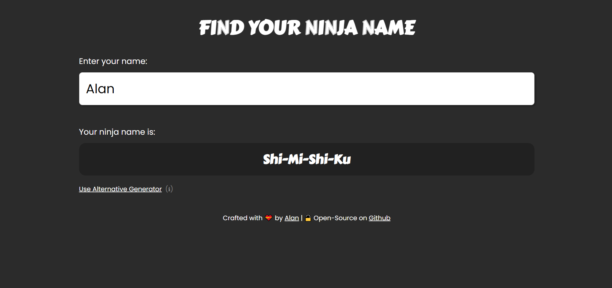

# Find Your Ninja Name 🥷

    

## [Demo](https://waterrmalann.github.io/ninja-name/)   |   [Source](https://github.com/waterrmalann/ninja-name/blob/main/js/script.js)

A super simple web app that to find your ninja name by either two methods. Your ninja name is basically the letters in your name substituted with ninja-y sounding words from a table. I used the two most popular ninja name reference sheets from Google and both are available for use in the app. Written in HTML, CSS, and vanilla JavaScript with zero dependencies.

- [Primary Generator](https://pinterest.com/pin/860820916258452299/)
- [Alternative Generator](https://pinterest.com/pin/792915078123848171/)

---

### Setup

A live version is available on my github pages [here](https://waterrmalann.github.io/ninja-name/). If you wish to modify the app or host it yourself, you can [clone the repo](https://docs.github.com/en/github/creating-cloning-and-archiving-repositories/cloning-a-repository-from-github/cloning-a-repository) and do whatever you want with it.

Running the `index.html` file on your web browser would be enough. However you could install an npm package like [live-server](https://www.npmjs.com/package/live-server) to host a little local development server with live reload capability.

---

### Contribution

Contributions are always accepted. Feel free to open a pull request to fix any issues or to make improvements you think that should be made. Any contribution will be accepted as long as it doesn't stray too much from the objective of the app. If you're in doubt about whether the PR would be accepted or not, you can always open an issue to get my opinion on it.

License
----

This project is licensed under the permissive **MIT License**, see [LICENSE](LICENSE)